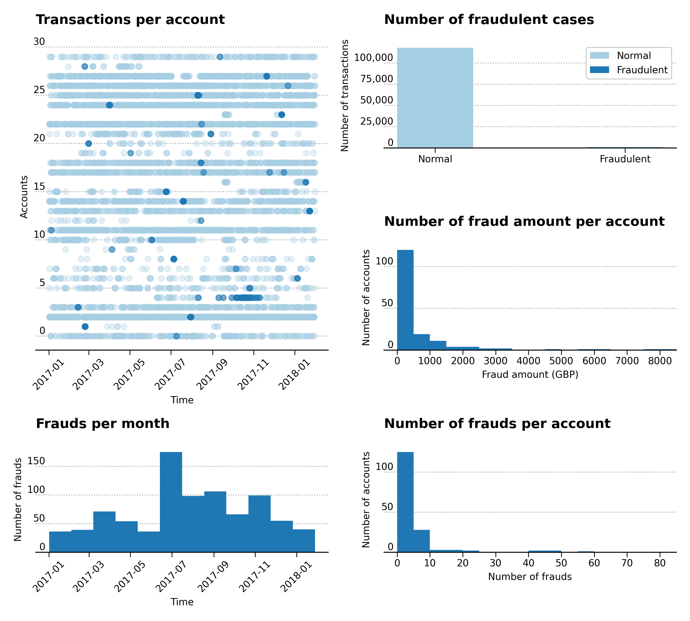
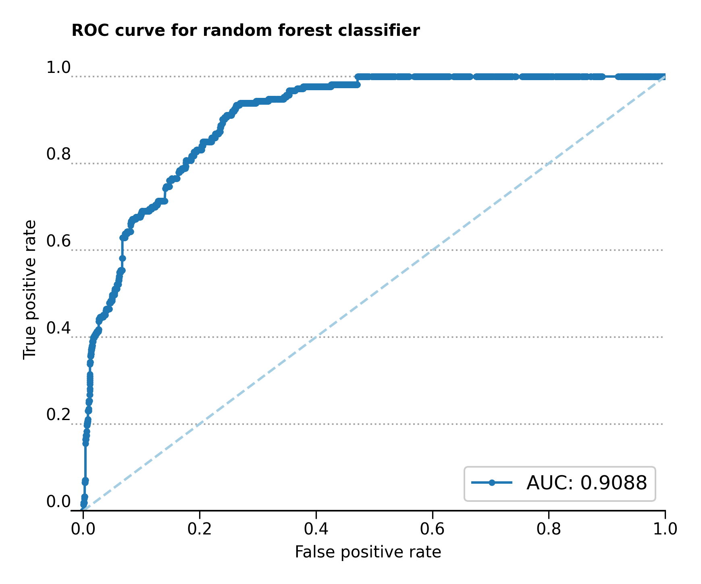

# Credit card fraud in payment transactions

## Introduction

Fraudulent payment transactions are of very grave concern for banking institutions, due to the financial losses and customer distrust they can potentially cause. Using one year's worth of card payment transactions, with fraudulent transactions appropriately flagged, the goal of this project is to produce a machine learning model that can predict fraudulent payment transactions. Moreover, due to the limited banking capacities, only 400 transactions per month can be investigated for fraud. After model generation and bootstrap simulation, a machine learning model was found to produce a 23.9% fraud detection rate over a 4.2% fraud detection rate by random transaction selection, producing a 5.7x improvement.

## Data preparation

Several changes were made to the data set. The `merchantZip` column contains 3260 unique categories, 19.4% of which are missing values, which increases to 31.6% if you include all of the entries marked as '0'. Both these values are labeled simply as `Unknown` and kept in the data set. The remaining `merchantZip` codes all figure below 1%. The most common values in `posEntryMode` are '5', '81' and '1', present respectively in 59.25%, 30.2% and 8.9% of cases, with the remaining below 1%.

In the analysis I decided to convert `eventId`, `accountNumber`, `merchantId`, `mcc`, `merchantCountry`, `merchantZip`, `posEntryMode` to string data type, because Scikit-Learn's [`DictVectorizer`](https://scikit-learn.org/stable/modules/generated/sklearn.feature_extraction.DictVectorizer.html "https://scikit-learn.org/stable/modules/generated/sklearn.feature_extraction.DictVectorizer.html") will only execute binary one-hot encoding when feature values are string data types. However, `eventId` and `merchantId` are dropped from the dataset due to the high amount of unique values which don't offer any discrimination. On the string data types, I calculated the [mutual information score from Scikit-Learn](https://scikit-learn.org/stable/modules/generated/sklearn.metrics.mutual_info_score.html#sklearn.metrics.mutual_info_score) (also called information gain) against the fraud case target. The low values for each of these features suggesting a low similarity between labels in the data set. `transactionTime` is set as a datetime type but is also dropped from the dataset. `transactionAmount` and `availableCash` are the only two numerical data types and are kept. The Pearson correlation between these two values is very low, suggesting no correlation between one another.

## Exploratory data analysis

The exploratory data analysis plot shows some interesting observations. Some of these observations are summarized in Table 1.

<figcaption>Figure 1 &ndash; Transactions per account, frauds per month, number of fraudulent cases, number of fraud amount per account and number of frauds per account. </figcaption>

| Description                                             | Value                    |
|---------------------------------------------------------|--------------------------|
| Total number of transactions                            | 118621                   |
| Number of non-fraudulent transactions                   | 117746 (99.26% of total) |
| Number of fraudulent transactions                       | 875 (0.74% of total)     |
| Total number of accounts                                | 766                      |
| Number of accounts with fraud                           | 167                      |
| Percentage of fraud per transaction                     | 0.74%                    |
| Percentage of accounts with fraud                       | 21.8%                    |
| Percentage of accounts with less than £1000 of fraud    | 83.23%                   |

The data set contains 118621 transactions of which 117746 are non-fraudulent transactions (99.26% of total) and 875 are fraudulent transactions (0.74% of total). The total number of accounts are 766, of which those subject to fraud are 167. Even though the percentage of fraud per transaction is small, fraud cases affect 21.8% of accounts. The percentage of accounts with less than £1000 of fraud is 83.23%.

## Modeling

I used the [`RandomUnderSampler`](https://imbalanced-learn.org/stable/references/generated/imblearn.under_sampling.RandomUnderSampler.html "https://imbalanced-learn.org/stable/references/generated/imblearn.under_sampling.RandomUnderSampler.html") class from [imbalanced-learn](https://imbalanced-learn.org/stable/index.html "https://imbalanced-learn.org/stable/index.html") to under-sample the majority class. Since in my dataset 875 cases are fraudulent, the imbalanced-learn class randomly selects without replacement 875 non-fraud cases to generate a balanced dataset. I used the the balanced dataset to build four, simple machine learning classifiers: logistic regression, decision tree, random forest and histogram gradient boosting. Of all three the random forest obtained the best balanced accuracy score, from 5-fold cross validation, at 0.819 ± 0.009 on the **unbalanced** test dataset. The [balanced accuracy score](https://en.wikipedia.org/wiki/Sensitivity_and_specificity "https://en.wikipedia.org/wiki/Sensitivity_and_specificity") is defined as the mean of the recall of the two target classes.

| Balanced accuracy ($\mu ± \sigma$) | Training set values | Validation set values |
|------------------------------------|---------------------|-----------------------|
| Logistic regression                | 0.818 ± 0.099       | 0.815 ± 0.026         |
| Decision tree                      | 0.796 ± 0.073       | 0.78 ± 0.027          |
| Random forest                      | 0.814 ± 0.05        | 0.819 ± 0.009         |
| Histogram gradient boosting        | 0.835 ± 0.08        | 0.812 ± 0.02          |

| Description                                                     | Value  |
|-----------------------------------------------------------------|--------|
| Model fraud detection rate using the 400 most-likely detections | 27.78% |
| Balanced accuracy score                                         | 61.92% |
| Recall score                                                    | 27.78% |
| Average random fraud detection rate on 30 bootstrapped sets     | 5.19%  |
| Improvement of model detection over average random detection    | 5.4x   |

<figcaption>Table 2 &ndash; Results from first test set. </figcaption>

| Description                                                     | Value  |
|-----------------------------------------------------------------|--------|
|Model fraud detection rate using the 400 most-likely detections  | 20.0%  |
|Balanced accuracy score                                          | 58.01% |
|Recall score                                                     | 20.0%  |
|Average random fraud detection rate on 30 bootstrapped sets      | 3.25%  |
|Improvement of model detection over average random detection     | 6.2x   |

<figcaption>Table 3 &ndash; Results from second test set. </figcaption>

| Description                  | Value  |
|------------------------------|--------|
|Model detection rate average  | 23.89  |
|Random detection rate average | 4.22   |

<figcaption>Table 4 &ndash; Average improvement of model over random selection. </figcaption>

The result of undersampling the majority case and using the random forest classifier can be observed in the [receiver operating characteristic](https://en.wikipedia.org/wiki/Receiver_operating_characteristic "https://en.wikipedia.org/wiki/Receiver_operating_characteristic") curve in Figure 2. The curve tends to the upper left-hand corner of the plot and a high value of 0.9088 proves the performance of this particular classifier.

<figcaption>Figure 2 &ndash; Receiver operating characteristic (ROC) curve for random forest classifier. </figcaption>
